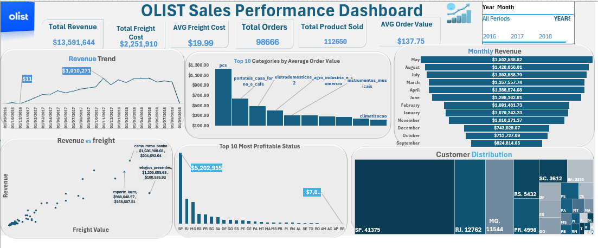
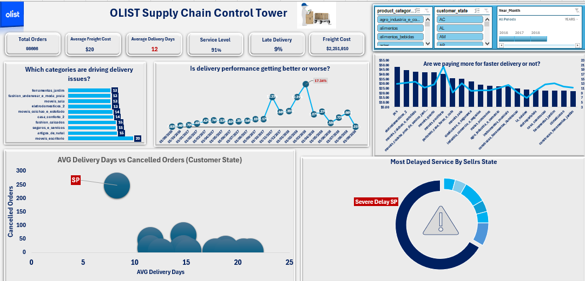
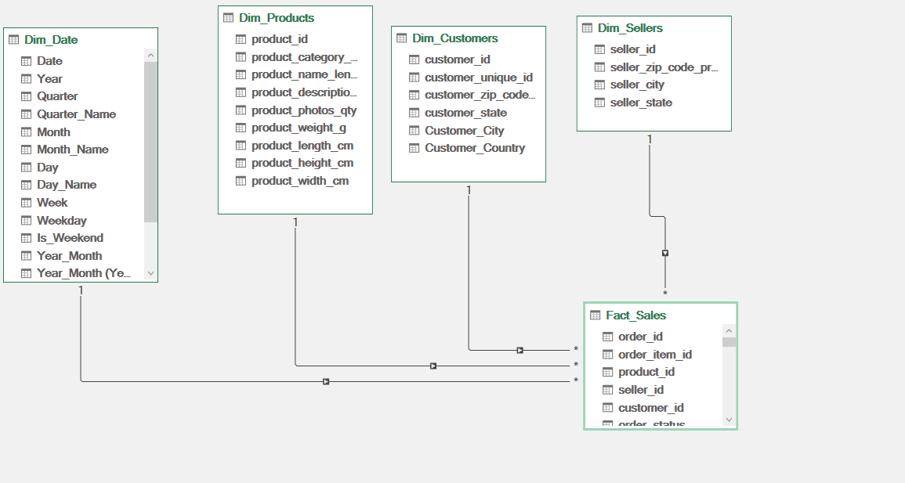

# OLIST Business Intelligence Platform

End-to-End Business Intelligence Project combining **Sales Analytics**, **Supply Chain Analytics**, **Python**, **Power Query**, **Power Pivot**, **Data Modeling**, and **Interactive Excel Dashboards**.

---

# Dashboard Preview

## Sales Analytics Dashboard



## Supply Chain Control Tower



## Data Model



---

# Project Overview

This project transforms raw OLIST Brazilian E-Commerce data into a complete Business Intelligence platform that supports strategic decision-making across both Sales and Supply Chain operations.

The project covers the complete analytics lifecycle from raw data preparation to executive dashboards and business recommendations.

---

# Business Objectives

- Analyze Sales Performance
- Monitor Supply Chain Operations
- Measure Delivery Performance
- Detect Operational Bottlenecks
- Improve Customer Experience
- Support Data-Driven Decision Making

---

# Project Workflow

1. Business Understanding
2. Data Cleaning using Python
3. Feature Engineering
4. Exploratory Data Analysis (EDA)
5. Power Query Transformation
6. Data Modeling using Power Pivot
7. DAX Measures Creation
8. Dashboard Development
9. Business Insights
10. Strategic Recommendations

---

# Tech Stack

- Microsoft Excel
- Power Query
- Power Pivot
- DAX
- Python
- Pandas
- NumPy
- Matplotlib
- Plotly
- GitHub

---

# Key KPIs

### Sales

- Total Orders
- Total Revenue
- Average Order Value
- Freight Cost
- Delivery Performance

### Supply Chain

- Service Level
- Late Delivery Rate
- Average Delivery Days
- Cancelled Orders
- Seller Performance
- Delivery Delay Analysis

---

# Python Work

Python was used for:

- Data Cleaning
- Missing Values Handling
- Feature Engineering
- Exploratory Data Analysis
- Data Validation
- Business Metrics Preparation

---

# Key Business Insights

- Delivery delays are concentrated within specific seller states.
- SP shows the highest operational risk due to the combination of high cancellation volume and seller delivery delays.
- Certain product categories consistently generate more late deliveries.
- Freight cost does not always guarantee faster delivery.
- Improving seller performance in high-risk regions can significantly enhance the overall service level.

---

# Strategic Recommendations

- Prioritize operational improvements for sellers located in SP.
- Build an early warning system for delayed shipments.
- Continuously monitor service level and cancellation trends.
- Optimize logistics for categories with consistently high delivery delays.
- Review freight cost strategy to maximize logistics efficiency.

---

# Repository Structure

```
Images/
Python/
Presentation/
README.md
```

---

# Author

**Islam Al-Zqaqy**

Data Analyst | Business Intelligence | Supply Chain Analytics | Sales Analytics
